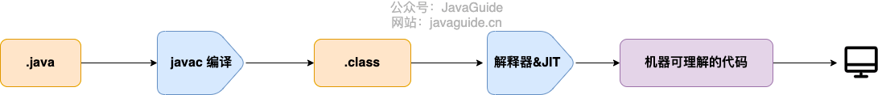

# java语言的特点

--- 
* java语言有哪些特性

1. java是面向对象语言，有封装、继承、多态的特性；
2. java通过jvm java虚拟机实现平台无关性，可以实现跨平台运行；
3. 还有一些其他的特性，比如支持多线程，支持网络编程，而且最重要的是丰富的java生态，有各种框架、中间件的支持。
---
* java与C++之间的区别？

       java和C++都是面向对象的语言，都具有封装、继承、多态的特性，但是也有一些不同的地方。

1. java不提供指针访问内存，程序访问内存更安全；
2. java的类是单继承，不支持多继承，c++是支持多继承的，但是java的接口可以实现多继承；
3. java有垃圾回收机制，不需要像C++一样手动释放无用内存；
4. C++同时支持操作符重载和方法重载，java只支持方法重载。
---
* jvm、jdk与jre的区别？

1. jvm指的是java虚拟机，java代码编译为class文件之后，就会通过java虚拟机运行java字节码，不同的平台实现的java虚拟机是不一样的。java主要是通过jvm虚拟机实现一次编写，随处运行的；
2. jdk是指java开发工具包，包括jre和javac编译器还有其他工具（比如javadoc和jdb），有了jdk之后就可以创建和编译程序；
3. jre是指java运行时环境，包括jvm虚拟机、java类库、java命令和一些基础构件，可以运行编译后的java程序但是不能用于创建新程序。

---
* Oracle JDK与OpenJDK有什么不同？
首先Oracle JDK是有Oracle公司维护的，有专门人员维护所有它的版本会更稳定，在响应性和jvm性能方面也更好。而OpenJDK是开源的。发布周期的话Oracle JDK会更长。两个JDK使用的时候协议也不一样，OpenJDK可以遵守GPL协议根据需要修改。

---

* 什么java字节码？使用java字节码有什么好处？

因为有了字节码就不用关心底层平台的差异了，只需要交给java虚拟机就行，不同平台的java虚拟机可以运行同一份字节码文件，实现编程时的语言无关。

---

* java程序运行流程是什么样的？

java代码从源程序到运行的过程如下图：

首先java文件会通过javac编译器编译为class字节码，然后通过java虚拟机把字节码文件逐行解释执行，解释的工程中java会用JIT编译器，当JIT完成第一次编译后，会把字节码对应的机器码保存下来，下次直接使用，所以运行效率比java解释器要高一些。的解释器&JIT编译为机器可理解的机器码，最后运行。

---

#异常

---

* java有哪些异常？

java的异常分为Exception和Error，他们的父类都是Throwable。

Exception表示**程序可以自身处理的异常，可以通过catch进行捕获**，Exception分为CheckedException和UnCheckedException，受检异常和非受检异常。

Error表示**程序无法处理的错误**，比如Java虚拟机运行错误、OutOfMemoryError、类定义错误NoClassDefFoundError，这些错误发生的时候，java虚拟机一般会终止线程运行。

受检异常表示**需要被catch或throws关键字处理的异常**，不然的话编译不通过。

非受检异常就是**编译过程中，即使不处理也可以正常通过的异常**。

受检异常有：IO相关的异常，比如FileNotFoundException、ClassNotFoundException、SQLException；

非受检异常主要是RuntimeException和它的一些子类，主要有：NullPointerException、IllegalArgumentException、NumberFormatException、ArrayIndexOutOfBoundsException、ClassCastException、ArithmeticException...

---

* Throwable类常用方法有哪些？

1. String getMessage() //返回异常发生时的简要描述
2. String toString() //返回异常发生时的详细信息
3. String getLocalizedMessage() //返回异常对象的本地化信息，继承Throwable的子类可以复写这个方法生成本地化信息
4. void printStackTrace() //在控制台打印Throwable对象封装的异常信息

---

* finally中的语句一定会执行吗？

不一定，比如在catch语句中提前终止当前线程的运行，可以通过调用System.exit(1)方法终止当前正在运行的虚拟机，那finally语句中的代码就不会执行。

---

* try-catch-finally语法糖的字节码角度分析一下？

---

* 如何使用try-with-resources代替try-catch-finally？

java中使用一些需要手动关闭的资源的时候可以使用try-with-resources，这些资源比如是InputStream、OutputStream、Scanner、PrintWriter等这些资源。

这些资源必须是实现AutoClosable或Closeable的对象；

好处是代码更简洁，不需要手动调用资源的close()方法。

---

* 异常使用有哪些需要注意的地方？

1. 异常不要定位为静态变量，应该每次抛出异常时都new一个异常对象，不然会导致异常栈信息错乱；
2. 抛出的异常信息一定要有意义；
3. 抛出的异常应该更具体，比如字符串转化数字格式异常应该抛出NumberFormatException，而不是他的父类IllegalArgumentException。

---

# 泛型

---

* 什么是泛型？使用方式有哪些？有什么好处？

泛型就是指类型参数，在定义类、接口、方法的时候使用类型作为参数，可以对不同参数类型复用同一份定义代码。

泛型一般有三种使用方式：泛型类、泛型接口、泛型方法。

好处是：

1.编译时更强的类型检查；

2.程序员可以实现通用算法，比如实现一些泛型算法，可以适用于不同类型的集合。

---

* 上限通配符和下限通配符

上限通配符用extends放宽对变量类型的限制，必须是这种类型或这种类型的子类。

下限通配符用super关键字把参数类型限制为特定类型或该类型的超类型，必须是这种类型或这种类型的父类

---

* 项目中哪里用到了泛型？

---

* 什么是类型擦除？

---

# 反射

---

* 什么是反射？

反射就是java提供的一种可以在运行时操作类的机制，比如可以获取一个类的所有属性和方法，也可以调用这些属性和方法。

---

* 反射的优缺点？

优点：让代码更加灵活，为各种框架提供开箱即用的功能，比如注解、动态代理这些机制都用到了反射；

缺点：因为反射可以在运行时操作类，所以会带来安全性的问题，比如在使用泛型参数的时候，使用反射会绕过泛型参数的安全检查。而且使用反射之后代码的性能也会受到影响。

---

* 为什么使用反射？

---

* 如何使用反射？

---

* 反射的应用场景？

平时使用到的一些框架中都会大量使用反射机制，比如sping boot、Mybatis这些框架都使用了动态代理技术，而动态代理的实现也依赖反射。另外java中的注解也是用到了反射。

---

# 注解

---

* 什么是注解？

注解是从java 5开始引入的一个新特性，可以用来修饰类、变量或方法，提供某些信息供程序在编译或运行的时候使用。
本质是一个继承了Annotation的特殊接口，jdk提供了很多内置的注解，比如@Override、@Deprecated，也可以自定义注解。

---

* 注解的解析方法有哪几种？

注解只有在解析之后才会生效。常见的解析方式有两种：

1. 一种是在编译期，编译器在编译代码的时候，扫描对应的注解，比如某个方法使用了@Override注解，在编译的时候就会检查这个方法是不是重写了父类对应的方法。

2. 另一种就是在运行期通过反射进行处理，比如像spring框架里自带的@Value注解、@Component注解都是通过反射进行处理。

---

* 平常会用到哪些注解？

---

# 序列化和反序列化

---

* 什么是序列化？什么是反序列化？

java里的对象如果需要持久化保存或者需要通过网络传输，都需要经过序列化和反序列化操作。

序列化：就是把数据结果或对象转换成二进制字节流的过程；

反序列化：就是把二进制字节流转换为对应的数据结果或对象的过程；

---

* 序列化常见的应用场景？

1. 对象在进行网络传输的时候，需要先被序列化，比如RPC远程调用方法的时候；
2. 将对象存储到文件之前需要序列化；
3. 将对象存储到数据库之前需要序列化；
4. 将对象存储到内存之前需要序列化。

---

* 如果实例中有些字段不想被序列化怎么办？

可以用transient关键字修饰这个字段。transient只能修饰变量，不能修饰类和方法。

---

* 常见序列化协议有哪些？

比较常见的序列化协议有Protobuf、Hessian、Kyro，这些都是基于二进制的序列化协议。

---

# IO

---

* Java IO流了解吗？

IO流表示数据从计算机内存到外部存储的流动，根据数据处理方式分为字节流和字符流。

Java IO流的40多个类都是从这4个基类派生出来的，分别是：

InputStream/Reader：是所有输入流的基类，InputStream表示字节流，Reader表示字符流；

OutputStream/Writer：是所有输出流的基类，OutputStream表示字节流，Writer表示字符流。

---

* 为什么要分字节流和字符流？

---

* Java IO中的设计模式有哪些？

---

* BIO、NIO、AIO的区别？

---

# 语法糖

---

* 什么是语法糖，有哪些语法糖？

语法糖就是编程语言为了方便开发程序设计设计出来的一种特殊语法，用这种语法可以写出更简单简洁的代码。

java中的语法糖有：foreach循环、泛型、自动拆装箱、变长参数、内部类、try-with-resources语法、lambda表达式。

---

* switch 支持String类型是如何实现的？

判断字符串的时候其实是判断字符串的哈希码是不是相等，所以其实本质还是比较字符串的哈希码的整型值。另外因为又可能会有哈希碰撞，所以在case语句里面还要加一层字符串之间的equals比较；

---

* 泛型是如何实现的？

在虚拟机里面没有泛型，泛型类没有自己独有的Class类对象，只有普通类和普通的方法，所有的泛型类的泛型参数都会在编译阶段被擦除，类型擦除的主要过程1.首先会将所有的泛型参数用他的最左边界类型替换，2.然后移除所有的类型参数；这是在编译阶段执行的。

---

* 自动装箱与拆箱

在装箱的时候会调用Integer的valueOf(int i)方法，在拆箱的时候调用的是Integer的intValue()方法。

---

* 可变长参数

可变参数在使用的时候首先会创建一个数组，数组的长度就是实参数的个数，然后再把参数值全部放到数组里，把这个数组作为参数传到原来的方法里。

---

* enum枚举类型

使用enum定义一个枚举类型的时候，编译器会自动帮我们创建一个final类型的类，继承Enum类型，所以enum枚举类型不能被继承。

---

* 内部类

内部类在编译的时候会生成两个class文件，内部类就相当于外部类的一个普通成员。

---

* 条件编译

如果if语句里面判断的是常量，java编译的时候会直接把常量为false的部分消除掉。

---

* 断言

断言实际上通过if语句判断的，如果为true的继续执行，如果为false，就会抛出AssertionError错误，终止执行。

---

* foreach的原理

foreach的原理就是使用简单的for循环还有迭代器实现的

---

* try-with-resources

编译之后会在try catch之后加上对应的关闭资源逻辑

---

* lambda表达式

lambda表达式执行的时候编译之后会调用一些底层的api，比如foreach编译的时候使用lambda表达式，后面的执行逻辑会生成一个函数，然后通过底层的LambdaMetaFactory调用生成的函数执行。

---

# SPI接口机制

---

* JDK中的SPI接口机制原理是什么？

SPI机制具体实现还是通过反射机制实现的。按照规定把要暴露对外使用的具体实现类声明在META-INF/services/文件下。
1. 然后JDK里的ServiceLoader类会首先通过URL工具类从jar包的/META-INF/services/目录下找到对应的问价；

2. 然后读取这个文件的名称找到对应的spi接口；

3. 通过InputStream流把文件里具体实现类的全类名读取出来；

4. 根据获取到的全类名，通过反射机制构造对应的实例对象；

5. 将构造出来的实例对象添加到providers列表中。

---

# java语法基础

2. String不可变的好处
可以缓存hash值；使用字符串常量池作为多个对象的引用；安全性（String经常作为参数，保证参数不可变）；线程安全；

3. String, StringBuffer, StringBuilder的区别和使用场景
String是不可变字符串，
StringBuffer是线程安全的，用在全局变量
StringBuilder是线程不安全的，用在确保单线程使用的局部变量

4. 怎样声明一个类不会被继承，有什么使用场景
用final修饰的类，使用场景比如java.lang.Math工具类

抽象类和接口的区别
抽象类不能被实例化只能被继承，类中只要有一个方法是抽象的就要声明为抽象类，
接口是抽象类的延伸，在java 8之前接口中不能有方法实现，java8之后接口中也可以有方法实现，接口成员（字段+方法）默认都是public的，接口字段默认都是static和final的。

抽象类提供一种is-a关系，需要满足里氏替换原则，子类对象必须能都替换所有父类对象，接口提供一种like-a关系，只是提供一种方法实现契约
使用上看，一个类可以实现多个接口，但是只能继承一个抽象类
接口的字段只能是static+final的，抽象类没有这种限制
接口的成员只能是public的，抽象类没有这种限制

重写和重载区别
重写是继承体系中的，指子类实现一个与父类在方法声明上完全相同的一个方法，使用override注解检查是否满足重写的原则
重载指在一个类中，一个方法与一个已经存在的方法名称相同，但参数类型、个数、顺序至少有一个不同。

java8中的新特性
lambda表达式
streams
Date和Time api
移除永久代

TreeSet和HashSet
TreeSet使用红黑树实现，支持有序查找，查找效率比HashSet低，时间复杂度是O(logN)
HashSet基于Hash表实现，支持快速查找，但不支持有序查找，并且失去了元素的插入顺序，
LinkedHashSet：具有HashSet的查找效率，并且内部使用双向链表维护元素的插入顺序。

ArrayList和LinkedList
ArrayList基于动态数组实现，支持随机访问
LinkedList基于双向链表实现，只能顺序访问，但是可以快速在链表中间插入和删除元素，LinkedList还可以用作栈，队列和双向队列。

3. 自定义异常在生产中如何使用
java的异常机制
Throwable：Error（OutOfMemoryError + IOError） + Exception （IOException + NullPointerException）
常见异常：IndexOutOfBoundsException、NullPointerException、
一般会继承Exception类自定义业务里的异常，比如鉴权，参数校验等，

4. ABA问题遇到过吗？
两个线程同时更新某个值从a到b，线程1正常将a更新成b，线程2发生阻塞等待，此时另一个线程3将b值更新成a；当线程2继续执行进行比较更新时，发现值是a，于是更新成b。
这个时候就发生了ABA问题，两个线程同时更新，应该只需要一个线程更新成功就可以了。
如何解决：加版本号或时间戳，通过控制变量值的版本来保证CAS的正确性，JUC里提供了一个带标记的原子引用类AtomicStampedReference类来解决这个问题。

5. Class的初始化过程是什么
类的加载过程包括：加载->验证->准备->解析->初始化
加载：1.通过类的完全限定名称，获取定义该类的二进制字节流；
   2、将该字节流表示的静态存储结构转化为方法区的运行时存储结构；
   3、在内存中生成一个代表该类的class对象作为方法区该类各种数据结构的访问入口。
验证：确保class文件的字节流符合虚拟机的要求
准备：为静态变量分配内存并设置初始值，使用的是方法区的内存
解析：将常量池的符号引用替换为直接引用
初始化：真正初始化静态变量和其他资源的阶段，开始执行类中代码。

6. HashMap结构
包含一个Entry类型的数组table，entry存储键值对，包含四个字段hashcode，k，v，next；数组中每个位置当成一个桶，
使用拉链法解决hash冲突。每插入一个Entry对，通过hash运算计算桶下标
扩容基本原理：当需要扩容时，table扩大两倍，重新计算桶下标，
从jdk1.8开始，一个桶的链表长度超过8时会将链表转化为红黑树，

7. ConcurrentHashMap底层原理是什么？
数组+链表+红黑树
和HashMap结构类似，不过实现了分段锁segment实现并发更新操作，
jdk1.8中使用CAS操作支持更高的并发度，CAS操作失败的时候会使用内置锁synchronized。链表过长时也会转化成红黑树。

8. GC如何判断对象可以被回收
引用计数法：为对象添加一个引用计数器
可达性分析：GCRoots开始搜索，可达的对象都是存活的，
虚拟机栈中局部变量表中引用的对象、本地方法栈中引用的对象、方法区中类静态属性以及常量引用的对象

引用类型：强引用（new一个对象）、软引用（在内存不够时回收）、弱引用（只能存活到下次垃圾回收）、虚引用（对象回收时收到系统通知）

10. 先行发生规则是什么？

9. java类加载器有哪些？
启动类加载器：将lib目录或-Xbootclasspath参数指定路径的类库加载到内存
扩展类加载器：将lib/ext目录或java.ext.dir指定路径中的类库加载到内存
系统类加载器：负责加载用户类路径上指定的类库，一般就是应用中默认的类加载器。
自定义类加载器：继承ClassLoader类，根据类型找到字节流，生成class对象

10.双亲委派模型
一个类加载器首先将类加载请求转发到父类加载器，只有当父类加载器无法完成时才自己尝试加载
好处：是使得java类和它的类加载器一起具有一种带有优先级的层次关系，使的基础类得到统一。比如自定义了一个Object类，并放到classpath中，系统会使用rt.jar中的Object

10. jvm8为什么要增加元空间

11. jvm内存模型如何分配
jvm内存分为
程序计数器：用来记录正在执行的虚拟机字节码指令的地址
java虚拟机栈：每个栈有多个栈帧，栈帧是每次调用方法时所占用的内存，栈帧里有局部变量表、操作数栈、常量池引用等信息。循环递归会发生栈溢出
本地方法栈：java调用本地的c或c++方法，存放在这里。
堆：存放通过new关键字存放的对象，线程共享，有垃圾回收机制。-Xms：堆初始大小，-Xmx：堆可以扩展的最大值，
可以将堆分为两块，新生代和老年代，
方法区：用于存放已被加载的类信息、常量、静态变量、即时编译器编译后的代码等数据。jdk1.8之前是在永久代中，1.8之后移除永久代，方法区移到元空间，
位于本地内存不是虚拟机内存
本地内存有：
元数据区（方法区）：用于存储类信息、静态变量、常量池。线程共享。

为什么要移除永久代？
永久代之前存放方法区和常量池，移除后方法区移到元数据区，常量池移到java堆中。
因为永久代会经常发生内存泄露或溢出。

12. jvm性能调优实战

13. jvm有哪些垃圾回收器，如何选择
serial parNew parallelScanvage
CMS serialold  parallelOld        G1

14. synchronized和lock有哪些区别
jvm实现，jdk实现
jvm有优化：自旋锁，锁消除，锁粗化，偏向锁
等待可中断：synchronized不可中断，lock可中断
公平锁：

15. ThreadLocal的原理是什么？

16. ThreadLocal有哪些内存泄露问题，如何避免

17. volatile的可见性和禁止指令重排序是如何实现的？

18. 程序开多少线程合适

19. 创建线程有哪些方式

20. 介绍线程的生命周期和状态

22. 描述一下线程安全活跃态问题，以及竞态条件

23. 内存溢出的原因有哪些，如何线上排查

24. 如何解决线上gc频繁的问题

25. 如何预防死锁
互斥
循环等待
占有且等待
不可抢占

26. 什么是守护线程
比如垃圾回收线程

27. 什么是字节码以及它的组成

28. 双亲委派机制是什么

29. 为什么要使用线程池

30. 线程池线程复用的原理是什么？

31. 线程的sleep， wait， join， yield如何使用

31. 有哪些垃圾回收算法

32. 反射
获取一个类的Class对象的四种方法：
1.通过ClassLoader对象的loadClass()方法
ClassLoader.getSystemClassLoader().loadClass("面经.reflectExample.methodClass");
2.类名.class
Class a = Test.class
3.Class.forName()
Class test = Class.forName("面经.reflectExample.methodClass")
4.Object.getClass()

33.反射的作用
1. 获得Class对象
2. 判断是否为某个类的实例：isInstance()
3. 创建实例：通过反射来生成对象主要有两种方式：使用Class对象的newInstance()方法来创建该类的对象；先通过Class对象获取指定的Constructor，再调用constructor的newInstance()方法;
4. 获取方法：获取某个Class对象的方法集合：getDeclaredMethods()(不包括继承的方法), getMethods()(返回包括继承类的方法), getMethod()
5 获取构造器信息
6 获取类的成员变量信息 getField()， getDeclaredField()
7 调用方法 method.invoke(obj, 1, 4), 

34 Object类中自有的方法有哪些？
Object.wait(), Object.equals(Object), Object.toString(), Object.hashCode(), Object.getClass(), Object.notify(), Object.notifyAll()

有状态到无状态是如何修改的？

多实例怎么保证本地缓存的一致性

线程池的大小和最大大小有什么区别

线程池提交一个线程后会有什么流程

synchronized实现原理

一个java文件有多个类，编译后会生成多少个class文件

两个线程死锁

单例模式

如何在另一个类中访问类中私有方法
答：通过反射技术，通过类的全限定名获取Class对象，实例化该对象，调用该对象的私有方法
Class<?> cls = Class.forName("");
Object obj = cls.newInstance();
Method method = cls.getDeclaredMethod("", )

如何保证数据库和缓存的双写一致性？
答：读的时候，先读缓存，缓存不存在再读数据库，更新缓存
写的时候，先写数据库，再删除缓存。因为缓存有可能是多个数据库表通过计算得到的，
其中一个表的数据更新没法修改缓存，而且缓存不一定会被频繁访问到，通过懒加载的形式，只有在访问到的时候再重新加载缓存。

rpc如何设计？

消息队列，实时流如何确保顺序？
答：在消费端线程处理数据前，写多个内存队列，将相同key的数据写入到同一个队列里面，
然后对于N个线程，每个线程消费其中一个队列里的数据。保证每个线程处理的数据的顺序是有序的。

消息队列如何保证消息不被重复消费？
答：kafka每条消息写进去会有一个offset值，代表消息的序号，然后消费者消费了数据之后会定时定期把消费过的offset值提交表示这条消息已经消费过了。

如何终止一个sleep的线程？
答：通过Thread.interrupt()方法

redis每种数据结构，有什么特性，可以实现什么功能

用过哪些juc的组件，怎么使用的？有什么功能

redis键的过期原理？

mysql查找一条数据的过程是怎样的？

mysql表太大了怎么办？
答：分库分表，将数据拆分放在多个表中，比如可以垂直拆分，或水平拆分，垂直拆分的话就是把一个有很多个字段的表拆分成多个表，每个表的结构都不一样；
水平拆分就是把一个表的数据放在多个库的多个表了，每个表的结构一样，只是存放的数据不一样。

mysql表分库分表之后主键id如何生成？
答：分布式id可以通过snowflake雪花算法来实现，41为时间戳，10位工作机器id，12位同一时间产生的不同id。

为什么选择离职？

动态代理？
答：动态代理是一种可以在运行期动态创建某个接口的实例，可以通过JDK提供的Proxy.newProxyInstance()创建一个接口对象，这种没有实现类，但是在运行期动态创建一个接口对象的方式叫动态代理。
Spring的代理方式有那两种？
答：JDK动态代理和CGLib动态代理
JDK动态代理的类通过接口实现，CGlib动态代理的类通过子类来实现。
为什么JDK动态代理要基于接口实现，而不是基于继承来实现？
答：因为JDK动态代理生成的对象默认是继承Proxy，java不支持多继承，所以JDK动态代理要基于接口实现。

多线程？

线程安全的集合类？
答：ConcurrentHashMap、CopyOnWriteArrayList、Vector、HashTable

线程的创建？
答：继承Thread类、实现Runnable接口、实现Callable接口。

垃圾回收？
答：标记-清除：在标记阶段，程序会检查每个对象是否是活动对象，如果是活动对象，会在对象头部打上标记；
在清除阶段，会进行对象回收并清除标志位，还会判断回收后的分块是不是有连续的空间，如果是连续的会合并两个分块，
标记-整理：让所有存活的对象都向一端移动，然后清理掉端边界以外的内存。
复制算法：会把内存划分成大小相等的两块，每次只使用其中一块，当这一块用完了就把还存活的对象移到另一端，然后在把使用过的空间进行一次清理。
分代收集算法：会根据对象存活周期将内存划分为几块，不同快使用不同的收集算法，比如新生代一般使用复制算法，老年代一般使用标记-清除或标记整理算法。

gc很慢如何排查？

redis分布式锁？
答：redis分布式锁实现，用setnx命令，redlock算法

两种单例模式的区别？

redis的单机和集群区别？
答：单机、主从模式、哨兵模式、集群模式

集群主备切换的过程？

arrayList与linkedList的区别？

mysql与oracle区别？

mybatis的#与$的区别？

gc过程？
答：对于G1收集器来说，G1的特点是会把对分成大小相等的独立区域，新生代和老年代不会互相隔离。可以对新生代和老年代一起回收。
1、初始标记：会标记一下从GC roots能直接关联到到对象，速度很快，需要停顿
2、并发标记：会进行GC roots的tracking过程，在整个回收过程中耗时最长，不需要停顿
3、最终标记：因为在并发标记阶段用户程序继续运行会导致标记产生变动，这个阶段就会修正变动到标记记录，
虚拟机会把这段时间对象变化记录在线程的remembered set logs里面，最终标记阶段会把remembered set logs的数据合并到remembered set里面，
这个阶段会停顿线程，但是可以并行执行，
4、筛选回收：首先会对每个region中的回收价值和成本进行排序，根据用户所期望的GC停顿时间来制订回收计划，

gc调优，常用的gc参数
答：-Xms 初始堆大小 -Xmx 最大堆大小

线程的5个状态？
答：new（新建）- runnable（可运行）- blocked（阻塞，其他线程占用monitor lock）- waitting（无限期等待，wait，join）- timedwaitting（限期等待，sleep）- terminated（死亡）

分布式锁和分布式事务？
答：常见的分布式锁有哪些解决方案：1、redis的分布式锁（setnx命令）；
2、基于zookeeper的有序节点的机制（首先会创建一个锁目录；当一个客户端想要获取锁的时候，会在这个锁目录下创建临时且有序的子节点；
客户端获取锁目录下的子节点列表，判断自己创建的字节点是不是列表中序号最小的字节点，如果是的话说明获取锁，否则就监听自己的前一个字节点，
每次都看自己的字节点是不是最小的序号）；
3、基于数据库的唯一索引（获取锁时向数据库插入一条记录，释放锁时删除这条记录）
分布式事务解决方案：事务的操作如果位于不同的节点上，要保证事务的acid特性，
1、2PC两阶段提交，通过引入一个协调者来协调参与者的行为，决定这些参与者是不是要真正执行事务。
2、本地消息表：分布式节点一端会在写业务数据的同时会写到本地消息表里，并且发送到消息队列，另一端的阶段从消息队列里取消息执行这条事务事务操作。

微服务和单体区别？优缺点？

final，finally，finalize
答：final修饰变量表示不可变，修饰方法表示不可重写，修饰类表示不可以被继承
finally是异常处理的一部分，表示trycatch之后
finalize是Object中的方法，可以重写finalize方法，当对象被回收时释放一些资源。

什么是线程安全？

volatile实现了哪些特性？

不用锁怎么实现线程同步？

CAS会带来什么问题？

wait notify await 

线程池拒绝策略有哪些？

两个线程交替打印？

ConcurrentHashMap从1.7到1.8的升级
答：jdk1.7使用分段锁机制来实现并发更新操作，核心类是segment，他是继承自ReentrantLock可重入锁，并发度和segment数量相等；
jdk1.8的话使用CAS操作支持更高的并发度，在cas操作失败的时候会使用内置锁synchronized，而且在1.8的实现中链表过长的话也会转化为红黑树。

concurrentHashMap的key和value可以为null吗？
答：不可以，会抱空指针异常，hashMap中存在二义性问题，如果用get方法得到某个key对应的值，如果这个key本身对应的value就是null，
就无法分清到底是不存在这个key还是说存在这个key但是value为null。
hashmap解决二义性是在containsKey方法中获取getNode，判断node是否为空。
而在concurrentHashMap中他是线程安全的，一般用在并发环境中，在get方法获取null之后，在用containsKey判断是否有这个key，
在这两个操作之间可能有其他线程修改map，所以只能不支持null。

支付平台怎么确保支付一致性？
答：可以用分布式锁，在操作某条数据的时候加锁，防止其他并发操作修改这条数据。第二种是可以用消息队列，消息队列有ack机制，客户端处理消息并处理数据后，
客户端发送ack消息给消息中间件，如果消息中间件超过指定时间还没收到确认，会定时重发消息。

1.http请求时几种超时时间
2.数据库表设计时需要考虑哪些方面，设计原则有哪些
3.spring bean加载有没有自己写过自定义处理方法
4.有没有写过代码生成器
5.账户更新余额，分布式怎么加锁，表加行锁怎么加
6.用的什么ORM框架，怎么配置连接池
7.数据库的明文密码怎么加密
8.数据库设计第一范式第二范式
9.spring用过哪些核心注解
10.spring使用@transactional的有几种参数

乌鸫科技
数据库需要加强？